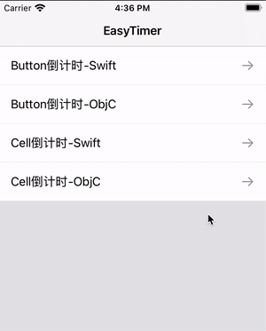

# EasyTimer


## 轻量级的计时器

#### 示例图



### 概述

`EasyTimer`是轻量级的计时器，能帮助你轻松管理倒计时等功能。可对`UITableViewCell`或`UICollectionViewCell`中的倒计时进行统一管理。

### 要求

- Swift 5.0 / Objective-C
- Xcode 11
- iOS 9.0+

### 使用

------

`EasyTimer`的`updater`支持传入遵循`EasyTimerUpdater`协议的对象，也可以传入`UITableView`或`UICollectionView`对象，`EasyTimer`会自动查找遵循`EasyTimerUpdater`的`Cell`对象，然后触发回调方法`func timerUpdate(interval: TimeInterval)`

##### Swift

```swift
//初始化EasyTimer
self.timer = EasyTimer()
//初始化EasyTimer，并传入updater和触发间隔
self.timer = EasyTimer(updater: self, interval: 0.5)
```

```swift
//启动
timer.run()
//停止
timer.pause()
```

```swift
//updater为ViewController，则ViewController实现EasyTimerUpdater协议的回调方法
extension ViewController: EasyTimerUpdater {
    func timerUpdate(interval: TimeInterval) {
      	//在这里更新倒计时
        print(interval)
    }
}

//updater为UITableView或UICollectionView，则对应Cell实现EasyTimerUpdater协议的回调方法
extension UITableViewCell: EasyTimerUpdater {
    func timerUpdate(interval: TimeInterval) {
      	//在这里更新cell的倒计时
        print(interval)
    }
}
```

##### Objective-C

```objective-c
//初始化EasyTimer
self.timer = [[KFEasyTimer alloc] init];
//初始化EasyTimer，并传入updater和触发间隔
self.timer = [[KFEasyTimer alloc] initWithUpdater:self interval:0.5];
```

```objective-c
//启动
[self.timer run];
//停止
[self.timer pause];
```

```objective-c
//updater为ViewController，则ViewController实现EasyTimerUpdater协议的回调方法
@interface ViewController ()<KFEasyTimerUpdater>
@end

@implementation ViewController
- (void)timerUpdateWithInterval:(NSTimeInterval)interval {
    //在这里更新倒计时
}
@end

//updater为UITableView或UICollectionView，则对应Cell实现EasyTimerUpdater协议的回调方法
@interface TableViewCell ()<KFEasyTimerUpdater>
@end

@implementation TableViewCell
- (void)timerUpdateWithInterval:(NSTimeInterval)interval {
    //在这里更新cell的倒计时
}
@end
```

### 集成

##### CocoaPods

```ruby
pod 'KFEasyTimer'
```

##### Swift Package Manager

```swift
dependencies: [
    .package(url: "https://github.com/moliya/EasyTimer", from: "1.2.0")
]
```

### License

EasyTimer is released under the MIT license. See LICENSE for details.